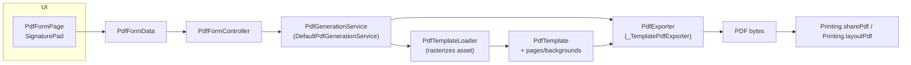

# Flutter PDF Editor
This is an example of how you can complete in app forms and rasterize them to a PDF document.

Pages can be configured with very specific fields. You can modify or add new fields.

To use, make sure to run `flutter pub get` and choose a device (mobile recommended). Then `flutter run` or debug with what ever tool you want.

The example pdf in assets demonstrates a simple pdf with different types of fields. Some can required or not. You define that in the field.

## Architecture Overview

At runtime the app follows a simple pipeline: the UI collects values, the controller hands them to a service, and the exporter merges them with the configured template. You do **not** need to know any PDF internals—each step has a focused role.

- **Configuration layer** (`PdfTemplateConfig`, `PdfTemplatePageConfig`, builders): declares *what* should appear on each page—field bindings, coordinates, sizes. Pure data, easy to read.
- **Loader** (`PdfTemplateLoader`): takes the config, rasterizes the template PDF into background images, and outputs a ready-to-use `PdfTemplate`.
- **Runtime template** (`PdfTemplate`, `PdfTemplatePage`): cached result that combines the background artwork with the fields for each page.
- **Exporter** (`PdfExporter`, `_TemplatePdfExporter`): merges user data (`PdfFormData`) with the runtime template and produces the final PDF bytes.

This separation keeps the code approachable: configuration stays declarative, rasterization happens once per asset, and rendering is a straightforward data merge.

## getfields.py
This script takes in an argument for the path of the PDF file. It will extract all fields and export then into a json document for reference.
You could make it generate form fields for the Flutter project. But it is usable and good for now.

Note, the geneneration of the fields could differ depending on they're defined. You can do the insertion of fields with trial and error.
However, inserting form fields into PDF's seems like a nice to have. I used a free service to do so. I also made my fields "hidden", but you can still parse them with PyPDF2.

Website/Service Used to Apply Fields: https://www.pdfgear.com/create-fillable-pdf/

# Screenshots

